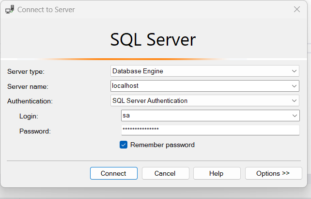

# Astrotalk-api
Assignment for creating web-app using java spring-boot for Hospital management staff.

This is a spring boot application that supports token based authentication with JWT, it covers the following concepts

    Flow for employee signup and signin without JWT Authentication
    Spring boot application architecture with spring security
    After Signup and login, use the token to interect with other Api.
    Using spring data JPA to interact with sqlServer database.
    Use flyway to migrate the sql script on the Server Automatically.

This application runs on SqlServer database and the RESTApi are tested on Insomnia/Postman.

#### Steps for Application Initiallisation:-
 1. #### Set up local sqlServer database using docker image:-
    1. Install Docker desktop and run below command in cmd prompt.
    2. docker pull mcr.microsoft.com/mssql/server:2022-latest
    3. docker run -e "ACCEPT_EULA=Y" -e "MSSQL_SA_PASSWORD=<7277prE>" -p 1433:1433 --name dev --hostname dev -d  mcr.microsoft.com/mssql/server:2022-latest
    4. Run the dev container in docker desktop.
    5. Login to sql server management studio with credential set in step3.
    6. 
    7. Create a database with name astrotalk.
 ##### Or, we can use any sql server database, just update the credentials and url in application.yml file
2. Clone the existing repo.
3. Build the project using gradlew build.
4. Run the main method of application. This will run all the sql script mentioned in resource/DB folder using flyway.
5. Verify the changes in database with history table.

### Endpoint List
| Method | URL                     | Description                                                  |
|--------|-------------------------|--------------------------------------------------------------|
| Post   | /api/auth/signUp        | signUp new member with name,password and email.              |
| Get    | /api/auth/login         | login to get the authorization token                         |
| Get    | /api/patient/all        | Get all patient record, need Bearer Token to hit Patient api |
| Post   | /api/patient/ admit     | save the patient info while admit them in hospital           |
| Put | /api/patient/discharge | update the patient Record while discharge from Hospital      |
 
#### Technology Used
- Java 17
- flyway
- sqlServer
- Gradle
- Spring Security
- JWT
- Spring Boot 3.2.0
#### Demo
+ signUp new User

+ Login using SignUp credentials

+ Admit patient before logIn

+ Admit patient with token

+ Fetch all patient List

+ Update Status of patient

## Thanks